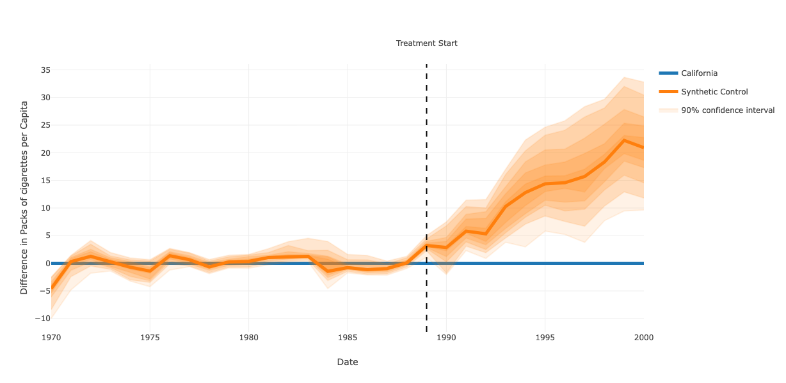

#################
Synthetic Control
#################

**A user friendly package for the Synthetic Control Method.**

The synthetic control method is a causal inference method introduced 
in `2003 by Abadie and Gardeazabal <https://www.jstor.org/stable/3132164>`_, 
for estimating the effect of a policy or treatment on a single unit.

This method relies on the comparison for a variable of interest between
the treated unit and a synthetic control group, which is created as a
weighted average of the comparable units. The synthetic control group
is chosen in such a way that the variable of interest is similar to that
of the treatment unit up to the treatment. After the treatment, the
variable of interest for the synthetic control group evolves freely which
allows estimating how the variable would have evolved had the treatment
not occured.

This package provides a simple interface for estimating the treatment effects
and their confidence intervals, as well as for visualizing results. It provides
an example `notebook <https://github.com/Bougeant/synthetic-control/blob/main/examples/california_proposition_99.md>`_ 
applied to the example of `California Proposition 99 <https://en.wikipedia.org/wiki/1988_California_Proposition_99>`_, 
a policy introduced in 1988 to increase taxes on the sale of tobacco cigarettes.
The synthetic control method has been applied by 
`Abadie, Diamond & Hainmueller <https://web.stanford.edu/~jhain/Paper/JASA2010.pdf>`_
to demonstrate the impact of this policy on tobacco consumption in California.

.. raw:: html
    :file: .images/california_prop_99_comparison.html

Installation
------------
Install using pip::

   pip install synthetic-control

Usage
------------
**Read and prepare dataset**::

   df = pd.read_csv("./california_prop99.csv")
   df["Year"] = pd.to_datetime(df["Year"], format='%Y')
   df = df.pivot(index="Year", columns="State",values="PacksPerCapita").round(1)

**Run synthetic control method**::

    sc = SyntheticControl(
        treatment_start=datetime(year=1989, month=1, day=1), 
        treatment_name="California"
    )
    y_pred = sc.get_results(df)

**Compare treatment and synthetic control groups**::

    sc.compare(df, y_pred, y_axis="Packs of cigarettes per Capita")

**Visualize impact of treatment**::

    sc.impact(df, y_pred, y_axis="Packs of cigarettes per Capita")

